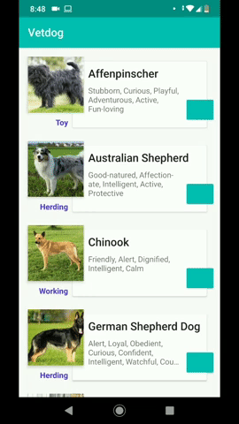

# Vetdog

Pet project using Clean Architecture + MVVM + Reactive Extensions + Android Architecture Components. 
The data is fetched from <a href='https://thedogapi.com/'>TheDogAPI</a>. 

  
  <i>*Data from <a href='https://thedogapi.com/'>TheDogAPI</a></i> 

